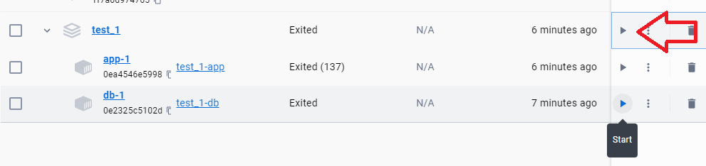
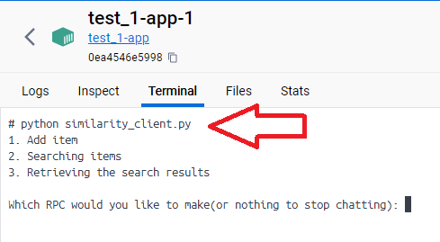

# To run project with Docker Desktop

- Clone repository
- ```git clone https://github.com/OleksandrCherniavskyi/Reply.io.git```
- ```docker-compose up -d```


- In Docker Desktop run ```app-1``` and ```db-1```container

- `some time, container to start in 5 time i don't know how it's fix in this moment`

- open terminal in ```app-1``` container

- run ```python similarity_client.py```
  

